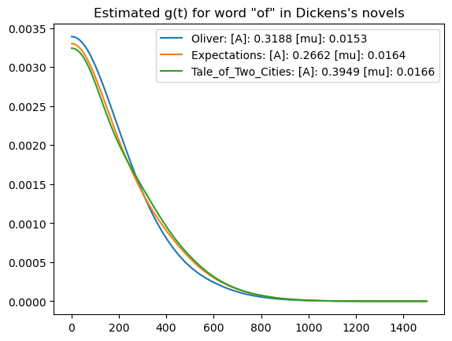

### Linguistic Hawkes Process Model Codebase
This Python codebase implements discrete hawkes process model for linguistic pattern analysis. Powered by `dask` backend, this repo is:
1. **Scalable**: Can be deployed on either single machine or cluster to model either short or long term process.
2. **Fast**: Highly parallelized. Extra speed-oriented fitting options are provided.
3. **Extendable**: Can be used in other context besides liguistic analysis; Only proper input data formatting is required.

#### Run the code

* **Create your own corpus**
Corpus file should be in `.json` format, where key is the token string (of, the, ...) and value is a list of integer that records the time stamps at which that token occurs in a book. 
A utility that automates corpus creation from text file is provided in `utils/scanner.py`, where `spacy-en_core_web_sm` is used as default tokenizer. And the default token position counting pipeline is

<pre style="text-align: center">
[beginning of file] To  be  or  not  to  be <font style="color: red">,</font> that  is  the  question <font style="color: red">.</font>
[lower case]        to  be  or  not  to  be <font style="color: red">,</font> that  is  the  question <font style="color: red">.</font>
[time stamp]        0   1   2   3    4   5  \ 6     7   8    9        \
[example result]    {'to': [0, 4], 'be': [1, 5], 'or': [2], ......}     
</pre>


```python
from utils.scanner import Scanner
ignore_list = [' ', '.', ',']   # character to exclude when counting token position
scanner = Scanner(ignore_list)
corpus, token_cnt = scanner.count_pos('Hamlet.txt')
# corpus: Dict[str, List[int]]: mapping from toke string to occurrence position
# token_cnt: int, total number of token (ignore_list excluded)
```
Feel free to create your own customed corpus with other tokenizer.

* **Entry Point**
```console
$ python main.py -h       # display options help menu
$ python main.py --word --corpus-path --total-word-num \
                 --ckp-save-path \
                 --epoch \
                 --X-bandwidth --lag-bandwidth
```
* **Args Spec**
    * __word__: target word in the book to consider
    * __corpus-path__: path to corpus json file
    * __total-word-num__: total word/token number of the book
    * __ckp-save-path__: save path of fitted checkpoint
    * __X-bandwidth__: bandwidth used when estimating distribution of occurrence 
    * __lag-bandwidth__: bandwidth used when estimating distribution of occurrence lag, i.e difference between any pair of occurrence
    * __epoch__: the number of fitting epoch

#### Workflow
Conditional intensity function $\lambda(t)$ is defined as 
$$\lambda(t) = P\{X_t = 1 |\mathcal{H}_t\}$$
In our example, we estimate $\lambda(t)$ for uni-variant case with the following equation
$$\lambda(t) = \mu_0 \mu(t) + A \sum_{i: t_i < t} g(t-t_i)$$
The objective likelihood function is 
$$\mathcal{L} = \sum_{i=1}^{N} log\[\lambda(t)\](X_i) + log\[1-\lambda(t)\](1-X_i)$$
where $X_i$ is an indicator variable for occurrence, $X_i=1$ denotes occurrence, $X_i=0$ denotes no occurrence.

Denote $\phi(t) = \frac{\mu(t)}{\lambda(t)}$ and $\rho_{ij}=\frac{g(t_j-t_i)}{\lambda(t_j)}$  

**E step: Update $\mu(t)$ and $g(t)$**

```math
\mu(t) \leftarrow \sum_{t_i \in N} \phi(t_i) \mathbb{1}[t \in [t-\Delta t, t+\Delta t]] \approx \sum_{t_i \in N} \phi(t_i) Z(t-t_i, \omega_{bg})
```

```math
g(t) \leftarrow \sum_{t_i, t_j \in N; t_i < t_j} \rho_{ij} \mathbb{1}[t_j-t_i \in [t-\Delta t, t+\Delta t]] \approx \sum_{t_i, t_j \in N; t_i < t_j} \rho_{ij} Z(t_j-t_i, \omega_{trigger})
```


**M step: Update $\mu_0$ and $A$**
$$\frac{\partial \mathcal{L}}{\partial \mu_0} = \sum_{t_i \in N} \frac{\phi(t_i)}{\mu_0} - \sum_{t \notin N} \frac{\mu(t)}{1-\lambda(t)}$$
$$\frac{\partial \mathcal{L}}{\partial A} = \sum_{t_i \in N} \frac{1-\phi(t_i)}{A} - \sum_{t \notin N} \frac{\sum_{j: t_j < t} g(t-t_j)}{1-\lambda(t)} $$
Iterative Optimization Approach
$$\mu_0^{k+1} \leftarrow \frac{\sum_{t_i \in N}\phi^k(t_i)}
{\sum_{t \notin N} \frac{\mu^k(t)}{1-\lambda^k(t)}}$$
$$A^{k+1} \leftarrow \frac{\sum_{t_i \in N} 1-\phi^{k+1}(t_i)}{\sum_{t \notin N}
\frac{\sum_{t_j:t_j < t} g^{k+1}(t-t_j)}{1 - \lambda^{k+1}(t)}
}$$


#### Advanced Options
**Parameter Init**
* __init-mu0__: initial value of $\mu_0$
* __init-A__: initial value of $A$
* __init-exp-lambda__: initial value of $\lambda$ parameterizing exponential distribution $\lambda e^{-\lambda x}$, which is used to initialize $g(t)$. 


**Fast Computation**
* __g-window-size__: when computing self excitation term, events occurred beyond this window this be truncated. Without truncating, the complexity for accumulative trigger calculation is $O(N^2)$.


**Memory Utilization**
When running on single machine, one of the major problems when fitting long process is OOM (out of memory) on RAM, the following arguments should be carefully tuned to prevent it.
* __X-chunk-size__: chunk size to split across entire episode 
* __kernel-chunk-size__: chunk size to split across occurrence
* __lag-chunk-size__: chunk size to split across occurrence lag

General Guide:
* Bottlenecks:
  * (#kernel_chunk_size, #occur_lag/#occur): estimation of the distribution of occurrence and lag of occurrence
  * (#lag_chunk_size, #g-window-size): calculation of accmulative self excitation term; events beyond g window will be truncated
  In single-machine scenario, the memory used by multiple workers collectively can be approximated by #num-worker $\times$ bottleneck, which should not exceed RAM capacity

* Monitering memory consumption with [Dask Daskboard](https://docs.dask.org/en/latest/dashboard.html) is highly recommended. 


Here are some of the results of $g(t)$ fitted on novels of Mark Twain and Dickens. $g(t)$ models how triggering effect between words varies with time/length of the interval. We believe that this metrics can be used to characterize writer's style.




